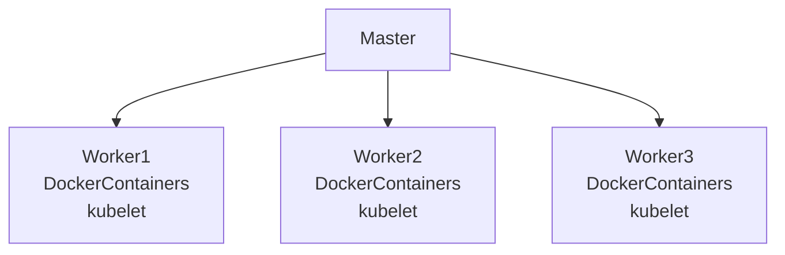

- [Introduction](#introduction)
- [K8s components](#k8s-components)
- [Docker vs Kubernetes](#docker-vs-kubernetes)
- [Docker Swarm vs Kubernets](#docker-swarm-vs-kubernets)

# Introduction

K8s: A container orchestration tool. It helps you manage containerized applications in different environments (physical, virtual, cloud).

Pods: The smallest deployable units of computing that you can create and manage in Kubernetes. It contains one or more container(s). Each pod is its own "self-container server", it has its own IP address. In K8s we only work with the Pods not the containers. Pod is an abstraction/wrapper on top of container(s). 

If a container dies inside a Pod it will be automatically restarted. Pods can also die but they are also created automatically. The new Pod will get a new IP. For other depending Pods changing to the new IP would have been a hastle therefore `Service` is used.

`Service` sits infront of each Pod and Pods talk to each other via `Service`. `Service` lifecycle is independant of the Pod. Service has a permanent IP and it is also a load balancer.

What problems does K8s solve?
The rise of microservice architecture required to tool to manage multiple containers, writing scripts wouldn't be enough.

What are the tasks of an orchestration tool?
- High availability or no downtime.
- Scalability or high performance.
- Disaster recovery - backup an restore.

# K8s components
- Master node: Runs the `API server`, `Controller manager`, `Scheduler`, `etcd`, `virtual network`.
  - API Server: it is a container and it is the entrypoint to K8s cluster.
  - Controller manager: Keeps track of what's happening in the cluster, if something needs a repaire or if a container needs a restart.
  - Scheduler: Ensures Pods placement based on the workload nad the available server resources on each node. Decides which worker node the next container should be scheduled on based on the available resources on the Worker Nodes.
  - etcd: key value storage. Holds the current state of the k8s cluster. It has the config data, status data of each node and each container. The backup and restore is made from this etcd snapshots   
- Worker Node: Runs Docker container(s) and kubelet.
  - Pod(s): Smallest unit in K8s, continas 1 or more container(s). Has its own IP, gets a new IP on restart.
    - Service: Sits infront of each Pod, has a static IP which does not change on Pod restart. Pods talk to each other via service. It can also act as a load balancer. 
    - Volume: Just like docker volume, it is a persistent storage for an individual Pod. Can be local storage on the node or remote outside of k8s cluster.
  - Ingress: Outside traffic talks to the Node via ingress. It is a Proxy. It takes outside requests and forwards them to the service(s) of the pods.
  - ConfigMap: Contains external config of your application like db connection string, etc. Pods can read data from it.
  - Secret: Like ConfigMap but it stores secret data like db username and password. Stores it in Base64. Pods can read data from it.
  - Deployment: Blueprint for the pods. You can define how many replicas you want, auto scalling etc in it. Pods of the same containers would share their Service (in this case Service also acts as a LB). DB can't be replication via deployment because DB has state.
  - StatefulSet: It does what `Deployment` does but for the stateful apps or DBs. 
- Virtual network: Spans all the nodes that are part of the cluster. Turns all the nodes inside of a cluster into one unified machine which has the sum of all the resources.
- You should always have backup masters in case if one goes down.

# Docker vs Kubernetes
| Docker                                                                   | Kubernetes                                                    |
| ------------------------------------------------------------------------ | ------------------------------------------------------------- |
| Containers, isolated environment for applications                        | infrastructure to manage multiple containers                  |
| Automated building and deploying applications - CI                       | Automated scheduling and management of application containers |
| Container platform for configuring, building and distributing containers | Ecosystem for managing a cluster of Docker containers         |

K8s Engine creates one unified K8s cluster, there are multiple servers in a cluster, each server runs docker container(s), `kubelet` is a k8s service that runs on each server and it enables docker to run on each server. Each K8s node has 1 kubelet installed. Docker Swarm is comparable to K8s.

In Docker Swarm instead of `K8s Engine` you would just have Docker running in the cluster and instead of `kubelet` you would have `docker daemon` on each server.

# Docker Swarm vs Kubernets

| Docker Swarm                                             | Kubernetes                                                 |
| -------------------------------------------------------- | ---------------------------------------------------------- |
| Easier installation                                      | Complex installation                                       |
| Lightweight and easier to use, but limited functionality | More complex with a high learning curve, but more powerful |
| Manual scaling                                           | Supports auto-scaling                                      |
| Needs 3rd party monitoring tools                         | Built in monitoring                                        |
| Integrates docker CLI                                    | Need for a separate CLI tool                               |
