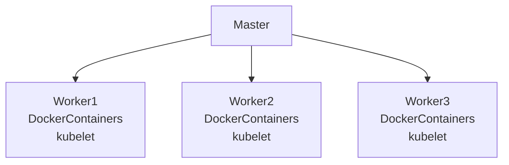

- [Introduction](#introduction)
- [K8s components](#k8s-components)
- [Docker vs Kubernetes](#docker-vs-kubernetes)
- [Docker Swarm vs Kubernets](#docker-swarm-vs-kubernets)
- [minikube](#minikube)
- [kubectl](#kubectl)
- [Commands](#commands)
- [Example](#example)
- [Questions](#questions)

# Introduction

K8s: A container orchestration tool. It helps you manage containerized applications in different environments (physical, virtual, cloud).

Pods: The smallest deployable units of computing that you can create and manage in Kubernetes. It contains one or more container(s). Each pod is its own "self-container server", it has its own IP address. In K8s we only work with the Pods not the containers. Pod is an abstraction/wrapper on top of container(s). 

If a container dies inside a Pod it will be automatically restarted. Pods can also die but they are also created automatically. The new Pod will get a new IP. For other depending Pods changing to the new IP would have been a hastle therefore `Service` is used.

`Service` sits infront of each Pod and Pods talk to each other via `Service`. `Service` lifecycle is independant of the Pod. Service has a permanent IP and it is also a load balancer.

What problems does K8s solve?
The rise of microservice architecture required to tool to manage multiple containers, writing scripts wouldn't be enough.

What are the tasks of an orchestration tool?
- High availability or no downtime.
- Scalability or high performance.
- Disaster recovery - backup an restore.

Layers of abstraction: `Deployment` manages --> `ReplicaSet` manages --> `Pod` is an abstraction of --> (docker) Container

Each specification file has 3 parts:
- metadata
- specification
- status *(automatically generated and added by k8s)*

Namespace: Organise resources in namespaces. You can have multiple namespaces in K8s cluster. It is like a virtual cluster inside a cluster. You can't access most resources from another namespace but you can share services across namespaces. Each namespace must define own configmap. You can't create volume or node within a namespace - these resources are at the cluster level, to check which resources cannot be defined in a namespace use `kubectl api-resources --namespaced=false`. By default kubectl uses the `default` namespace that's why you don't specify it in the commands, but if you use a specific namespace then you will have to specify it in the kubectl commands, since mentioning it everytime is annoying you can use a tool called `kubens` install it using `brew install kubectx`. By defauly k8s gives you 4 namespaces: `kubectl get namespace`. 
1. `kubernetes-dashboard` - Namespace comes only with minikube. 
2. `kube-system` - Meant for k8s only. Do not create or modify in it. System processes, Master and kubectl processes.
3. `kube-public` - Publicly accessible data, a configmap whcih contains cluster info. `kubectl cluster-info` returns the output from this configmap. 
4. `kube-node-lease` - heartbeats of nodes. each node has associated lease object in namespace. determines the availability of a node.
5. `default` - resources you create are located here.

To create a namespace `kubectl create namespace my-name`

Benefits of using namespaces:
1. structure your components.
2. avoid conflicts b/w teams.
3. share services b/w different environments.
4. access and rource limits on namespace level.

Ingress: Instead of making your service externally available so outside world can use it like http:ip:port, it is better to use ingress and keep the service internal. With ingress people can access site using https://domain.com. Outside requests first come to ingress and ingress forward to the actual service. You need an implementation for Ingress, which is ingress controller.
Ingress controller: It evaluates and processes ingress rules. manages redirections, entrypoint to cluster. many third party implementations.k8s has nginx ingress controller. In minikube install it using `minikube addons enable ingress` and then `get pod -n kube-system`. You can also setup tls by first create a secret yaml on the same namespace and then referenceing it in the ingress yaml.

# K8s components
- Master node: Runs the `API server`, `Controller manager`, `Scheduler`, `etcd`, `virtual network`.
  - API Server: it is a container and it is the entrypoint to K8s cluster.
  - Controller manager: Keeps track of what's happening in the cluster, if something needs a repaire or if a container needs a restart.
  - Scheduler: Ensures Pods placement based on the workload nad the available server resources on each node. Decides which worker node the next container should be scheduled on based on the available resources on the Worker Nodes.
  - etcd: key value storage. Holds the current state of the k8s cluster. It has the config data, status data of each node and each container. The backup and restore is made from this etcd snapshots   
- Worker Node: Runs Docker container(s) and kubelet.
  - Pod(s): Smallest unit in K8s, continas 1 or more container(s). Has its own IP, gets a new IP on restart.
    - Service: Sits infront of each Pod, has a static IP which does not change on Pod restart. Pods talk to each other via service. It can also act as a load balancer. 
    - Volume: Just like docker volume, it is a persistent storage for an individual Pod. Can be local storage on the node or remote outside of k8s cluster.
  - Ingress: Outside traffic talks to the Node via ingress. It is a Proxy. It takes outside requests and forwards them to the service(s) of the pods.
  - ConfigMap: Contains external config of your application like db connection string, etc. Pods can read data from it.
  - Secret: Like ConfigMap but it stores secret data like db username and password. Stores it in Base64. Pods can read data from it.
  - Deployment: Blueprint for the pods. You can define how many replicas you want, auto scalling etc in it. Pods of the same containers would share their Service (in this case Service also acts as a LB). DB can't be replication via deployment because DB has state.
  - StatefulSet: It does what `Deployment` does but for the stateful apps or DBs. 
  - Kubelet: Interacts with the Container runtime and manages the Node.
  - Kube Proxy: Used for intelligent request routing e.g. send the request to the pod on the same node if possible instead of sending it to another replica node.
  - Container runtime: For example Docker to run docker containers.
- Virtual network: Spans all the nodes that are part of the cluster. Turns all the nodes inside of a cluster into one unified machine which has the sum of all the resources.
- You should always have backup masters in case if one goes down.



# Docker vs Kubernetes
| Docker                                                                   | Kubernetes                                                    |
| ------------------------------------------------------------------------ | ------------------------------------------------------------- |
| Containers, isolated environment for applications                        | infrastructure to manage multiple containers                  |
| Automated building and deploying applications - CI                       | Automated scheduling and management of application containers |
| Container platform for configuring, building and distributing containers | Ecosystem for managing a cluster of Docker containers         |

K8s Engine creates one unified K8s cluster, there are multiple servers in a cluster, each server runs docker container(s), `kubelet` is a k8s service that runs on each server and it enables docker to run on each server. Each K8s node has 1 kubelet installed. Docker Swarm is comparable to K8s.

In Docker Swarm instead of `K8s Engine` you would just have Docker running in the cluster and instead of `kubelet` you would have `docker daemon` on each server.

# Docker Swarm vs Kubernets

| Docker Swarm                                             | Kubernetes                                                 |
| -------------------------------------------------------- | ---------------------------------------------------------- |
| Easier installation                                      | Complex installation                                       |
| Lightweight and easier to use, but limited functionality | More complex with a high learning curve, but more powerful |
| Manual scaling                                           | Supports auto-scaling                                      |
| Needs 3rd party monitoring tools                         | Built in monitoring                                        |
| Integrates docker CLI                                    | Need for a separate CLI tool|

# minikube
- Creates a Virtual Box on your machine
- Node runs in that VB.
- 1 Node k8s cluster
- used for testing purposes
- runs both master and workers on one VB

# kubectl
- tool to interact with a k8s cluster. Other 2 options are UI and API. It is the most powerful of the 3.
- can be used on local machine to interact with minikube.

# Commands

`kubectl get nodes` // returns the nodes
`kubectl get pod` // get the pod
`kubectl get services` // get the services
`kubectl create -h` // see all the things you can create, this command can't create Pod because you don't create Pods, you only work with the abstraction layer called `deployment`.
`kubectl create deployment NAME -image=image [--dry-run] [options]` // creates a deployment, image is the docker image name in most cases since you are using docker.
`kubectl get deployment`
`kubectl get replicaset`
`kubectl edit deployment NAME` // to edit a deployment, it will terminate the old pod and create a new one, it will also stop the old ReplicaSet and start a new one.
`kubectl logs NAME_OF_POD`
`kubectl describe pod POD_NAME`
`kubectl exec -it POD_NAME -- bin/bash` // to get the interactive terminal
`kubectl delete deployment NAME`
`kubectl apply -f [filepath/filename.yaml]` // reads the deployment config from the file and creates the deployment.

# Example

To create a deployment and a service on k8s I have added 2 sample `nginx-deployment.yaml` and `nginx-service.yaml` files.

1. Navigate to the directory of these files.
2. Execute `kubectl apply -f nginx-deployment.yaml`
3. Execute `kubectl apply -f nginx-service.yaml`
4. To validate execute `kubectl get pod` and `kubectl get service`
5. To validate if the service has the right pods `kubectl describe service nginx-service`
6. To check pod ip and ports `kubectl get pod -o wide`
7. To check if k8s added status info `kubectl get deployment nginx-deployment -o yaml`
8. To delete the deployment and service `kubectl delete -f nginx-deployment.yaml` and `kubectl delete -f nginx-service.yaml`.

You should see something like this:

```
kubectl get pod

NAME                               READY   STATUS    RESTARTS   AGE
nginx-deployment-95585b474-tmd5s   1/1     Running   0          3m6s
nginx-deployment-95585b474-xtqt9   1/1     Running   0          3m6s

kubectl get service

NAME            TYPE        CLUSTER-IP       EXTERNAL-IP   PORT(S)   AGE
kubernetes      ClusterIP   10.96.0.1        <none>        443/TCP   46h
nginx-service   ClusterIP   10.102.188.205   <none>        80/TCP    35s
```

```
kubectl describe service nginx-service

Name:              nginx-service
Namespace:         default
Labels:            <none>
Annotations:       <none>
Selector:          app=nginx
Type:              ClusterIP
IP Family Policy:  SingleStack
IP Families:       IPv4
IP:                10.102.188.205
IPs:               10.102.188.205
Port:              <unset>  80/TCP
TargetPort:        8080/TCP
Endpoints:         10.244.0.3:8080,10.244.0.4:8080 // ip & ports of the pods that this service must forward requests to, matches the info below
Session Affinity:  None
Events:            <none>
```

```
kubectl get pod -o wide

NAME                               READY   STATUS    RESTARTS   AGE   IP           NODE       NOMINATED NODE   READINESS GATES
nginx-deployment-95585b474-tmd5s   1/1     Running   0          11m   10.244.0.3   minikube   <none>           <none>
nginx-deployment-95585b474-xtqt9   1/1     Running   0          11m   10.244.0.4   minikube   <none>           <none>
```

```
kubectl get deployment nginx-deployment -o yaml

apiVersion: apps/v1
kind: Deployment
metadata:
  annotations:
    deployment.kubernetes.io/revision: "1"
    kubectl.kubernetes.io/last-applied-configuration: |
      {"apiVersion":"apps/v1","kind":"Deployment","metadata":{"annotations":{},"labels":{"app":"nginx"},"name":"nginx-deployment","namespace":"default"},"spec":{"replicas":2,"selector":{"matchLabels":{"app":"nginx"}},"template":{"metadata":{"labels":{"app":"nginx"}},"spec":{"containers":[{"image":"nginx:1.16","name":"nginx","ports":[{"containerPort":8080}]}]}}}}
  creationTimestamp: "2023-02-14T22:20:45Z"
  generation: 1
  labels:
    app: nginx
  name: nginx-deployment
  namespace: default
  resourceVersion: "4364"
  uid: 0f9b5244-c3cc-4409-a804-4616be462638
spec:
  progressDeadlineSeconds: 600
  replicas: 2
  revisionHistoryLimit: 10
  selector:
    matchLabels:
      app: nginx
  strategy:
    rollingUpdate:
      maxSurge: 25%
      maxUnavailable: 25%
    type: RollingUpdate
  template:
    metadata:
      creationTimestamp: null
      labels:
        app: nginx
    spec:
      containers:
      - image: nginx:1.16
        imagePullPolicy: IfNotPresent
        name: nginx
        ports:
        - containerPort: 8080
          protocol: TCP
        resources: {}
        terminationMessagePath: /dev/termination-log
        terminationMessagePolicy: File
      dnsPolicy: ClusterFirst
      restartPolicy: Always
      schedulerName: default-scheduler
      securityContext: {}
      terminationGracePeriodSeconds: 30
status:
  availableReplicas: 2
  conditions:
  - lastTransitionTime: "2023-02-14T22:20:49Z"
    lastUpdateTime: "2023-02-14T22:20:49Z"
    message: Deployment has minimum availability.
    reason: MinimumReplicasAvailable
    status: "True"
    type: Available
  - lastTransitionTime: "2023-02-14T22:20:45Z"
    lastUpdateTime: "2023-02-14T22:20:49Z"
    message: ReplicaSet "nginx-deployment-95585b474" has successfully progressed.
    reason: NewReplicaSetAvailable
    status: "True"
    type: Progressing
  observedGeneration: 1
  readyReplicas: 2
  replicas: 2
  updatedReplicas: 2
```

# Questions

1. How do you interact with the cluster?
   1. How to:
      1. schedule pod?
      2. monitor?
      3. re-schedule/re-start pod?
      4. join a new node?
   
    `Answer`: Master Node(s).